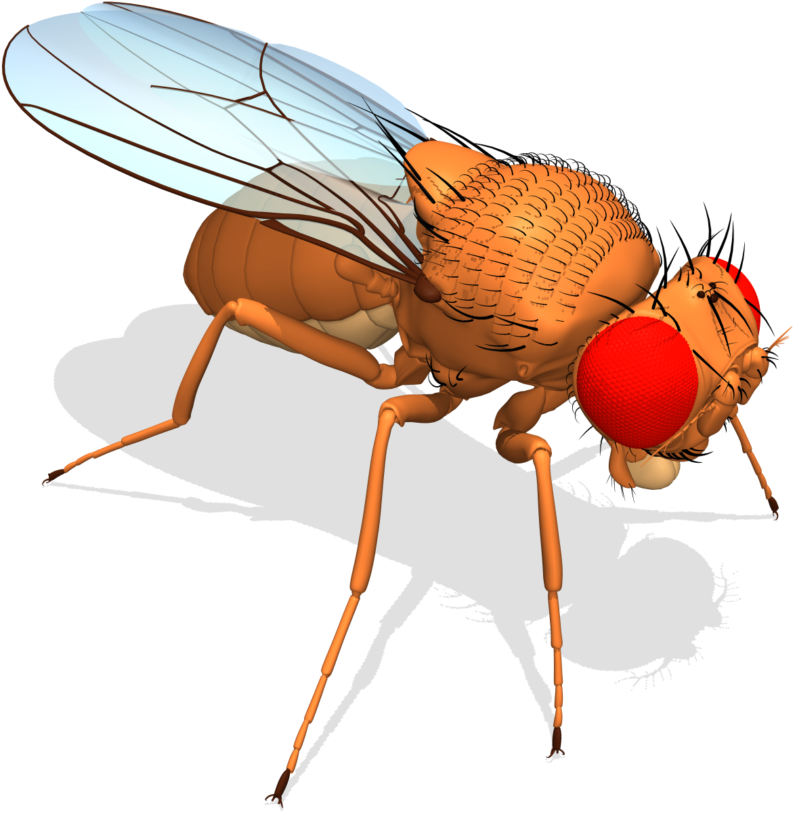

# `flybody`: fruit fly body model for MuJoCo physics




`flybody` is an anatomically-detailed body model of the fruit fly _Drosophila melanogaster_ for MuJoCo physics simulator and reinforcement learning applications. 

The fly model was developed in a collaborative effort by Google DeepMind and HHMI Janelia Research Campus. 

We envision our model as a platform for fruit fly biophysics simulations and for modeling neural control of sensorimotor behavior in an embodied context; see our accompanying [publication][paper].

## Getting Started

The quickest way to get started is to take a look at an introductory [tutorial notebook][tutorial] or [][tutorial-colab].

Also, [this notebook][envs] shows examples of the flight imitation, walking imitation, and vision-guided flight RL task environments. 

To train the fly, take a look at the [distributed RL training script][ray-script], which uses Ray to parallelize the DMPO agent training.

[tutorial]: https://github.com/TuragaLab/flybody/blob/main/docs/getting-started.ipynb
[tutorial-colab]: https://colab.research.google.com/github/TuragaLab/flybody/blob/main/docs/getting-started.ipynb
[envs]: https://github.com/TuragaLab/flybody/blob/main/docs/fly-env-examples.ipynb
[ray-script]: https://github.com/TuragaLab/flybody/blob/main/flybody/train_dmpo_ray.py
[paper]: https://www.biorxiv.org/content/10.1101/2024.03.11.584515
[ray]: https://github.com/ray-project/ray
[tf]: https://github.com/tensorflow/tensorflow
[acme]: https://github.com/google-deepmind/acme
[mujoco-rendering]: https://github.com/google-deepmind/dm_control/tree/main?tab=readme-ov-file#rendering

## Installation

Follow these steps to install `flybody`:

### Option 1: Installation from cloned local repo

1. Clone this repo and create a new conda environment:
   ```bash
   git clone https://github.com/TuragaLab/flybody.git
   cd flybody
   conda env create -f flybody.yml
   conda activate flybody
   ```
   `flybody` can be installed in one of the three modes described next. Also, for installation in editable (developer) mode, use the commands as shown. For installation in regular, not editable, mode, drop the `-e` flag.
   
2. **Core installation**: minimal installation for experimenting with the
   fly model in MuJoCo or prototyping task environments. ML dependencies such as [Tensorflow][tf] and [Acme][acme] are not included and policy rollouts and training are not automatically supported.
   ```bash
   pip install -e .
   ```
   
3. **ML extension (optional)**: same as core installation, plus ML dependencies (Tensorflow, Acme) to allow running
   policy networks, e.g. for inference or for training using third-party agents not included in this library.
   ```bash
   pip install -e .[tf]
   ```

4. **Ray training extension (optional)**: same as core installation and ML extension, plus [Ray][ray] to also enable
   distributed policy training in the fly task environments.
   ```bash
   pip install -e .[ray]
   ```

### Option 2: Installation from remote repo
1. Create a new conda environment:
   ```bash
   conda create --name flybody python=3.10 pip ipython cudatoolkit cudnn=8.2.1=cuda11.3_0
   conda activate flybody
   ```
   Proceed with installation in one of the three modes (described above):
2. **Core installation**:
   ```bash
   pip install git+https://github.com/TuragaLab/flybody.git
   ```
3. **ML extension (optional)**:
   ```bash
   pip install "flybody[tf] @ git+https://github.com/TuragaLab/flybody.git"
   ```
5. **Ray training extension (optional)**:
   ```bash
   pip install "flybody[ray] @ git+https://github.com/TuragaLab/flybody.git"
   ```
   
### Additional configuring

1. You may need to set [MuJoCo rendering][mujoco-rendering] environment varibles, e.g.:
   ```bash
   export MUJOCO_GL=egl
   export MUJOCO_EGL_DEVICE_ID=0
   ```
2. Also, for the ML and Ray extensions, `LD_LIBRARY_PATH` may require an update, e.g.:
   ```bash
   export LD_LIBRARY_PATH=$LD_LIBRARY_PATH:/your/path/to/miniconda3/envs/flybody/lib
   ```

3. You may want to run `pytest` to test the main components of the `flybody` installation.

## Citing `flybody`
See our accompanying [publication][paper]. Thank you for your interest in our fly model:)
```bibtex
@article{flybody,
  title = {Whole-body simulation of realistic fruit fly locomotion with
           deep reinforcement learning},
  author = {Roman Vaxenburg and Igor Siwanowicz and Josh Merel and Alice A Robie and
            Carmen Morrow and Guido Novati and Zinovia Stefanidi and Gwyneth M Card and
            Michael B Reiser and Matthew M Botvinick and Kristin M Branson and
            Yuval Tassa and Srinivas C Turaga},
  journal = {bioRxiv},
  doi = {https://doi.org/10.1101/2024.03.11.584515},
  url = {https://www.biorxiv.org/content/10.1101/2024.03.11.584515},
  year = {2024},
}
```
